# CloundVolunteer

毕业答辩结束啦，将项目开源吧，虽然做的不好，也算是对自己四年来的交代（小声bb：边耍边学，不能坚持学习，所以很菜🙄），以后继续努力吧。有需要的小伙伴可以拿去看看或魔改，代码写得烂，勿喷

免责声明：本项目仅供参考使用，若是因为直接使用项目造成任何损失和危害（比如撞项目）概不负责

## 一、简要介绍

本项目是一个志愿者服务系统，在系统中，志愿者可以参与收藏、申请参与志愿活动，可以申请加入志愿者团队；志愿活动需要由志愿单位进行发布，经由管理员审核通过后志愿者方可申请，并在系统中展示出来；志愿者团队和志愿单位用户的注册、志愿活动的发布都需要管理员进行审核，并且志愿者申请加入志愿者团队、申请参加志愿活动也需要相应用户审核

### 1.1 功能介绍

以下为系统大致功能：

* 志愿活动：包括发布、修改、审核、查看、申请、删除等，不同用户角色涉及到的不同业务操作；              
* 志愿资讯：发布展示志愿相关信息的资讯；        
* 用户信息：涉及用户信息管理（志愿者、志愿者团队、志愿单位），用户的登录注册，实名认证，注册审核，详细信息；     
* 消息通知：将用户的操作流程及结果以消息的形式进行通知；
* 捐赠：整合支付宝接口实现用户捐赠；         
* 系统信息管理：即后台管理部分，对系统的用户信息、志愿活动信息、捐赠记录信息、消息记录信息等进行管理，对用户注册、志愿活动等相关信息进行审核。

亮点部分：

* 整合`支付宝沙箱环境AliPay`模拟虚拟支付实现用户捐赠功能
* 使用`redis`+`容联云`短信服务实现用户登录注册的手机验证码功能
* 使用`腾讯云对象存储COS`实现项目图片的上传、存放和删除
* 接入`翔云证件识别API`实现志愿者用户的实名认证功能
* 使用`Echarts`+`网易疫情API`绘制全国实时疫情情况地图，并使用`Echarts`可视化系统已注册志愿者的所在地区分布

系统功能结构图如下：

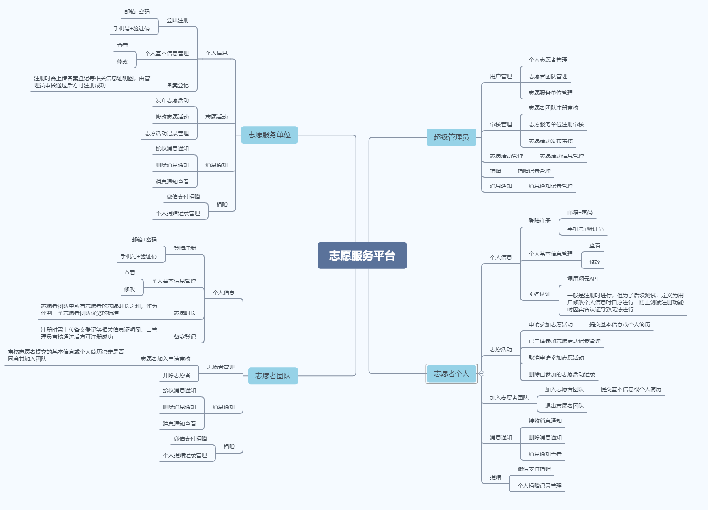

### 1.2 技术栈

#### 1.2.1 后端

`Spring Boot`+`MyBatis-plus`+`Redis`+`JWT`+`Mysql`等

#### 1.2.2 前端

`Vue3`+`Vite`+`Axios`+`ElementPlus`等

### 1.3 注意！！

由于整合接入外部API来实现部分功能时在配置方面会涉及部分个人信息，代码中这些地方我已将自己的信息删除，所以请认真查看后端部署中特殊配置部分，准确配置自己的信息

对于存储到腾讯云上的图片后续我会删除，这样就会导致项目运行起来后图片无法加载，所以尽量先把图片上传到自己的腾讯云存储桶中，然后修改数据库中的图片存储路径数据，或者舍去系统的对象存储功能，采用本地存储图片的方式，这样就需要自行编写本地存储图片的业务逻辑（项目中用到的所有图片都已下载保存到项目前端部分的`src/assets/`目录下）

## 二、部分效果展示

### 2.1 前台部分

#### 2.1.1 首页

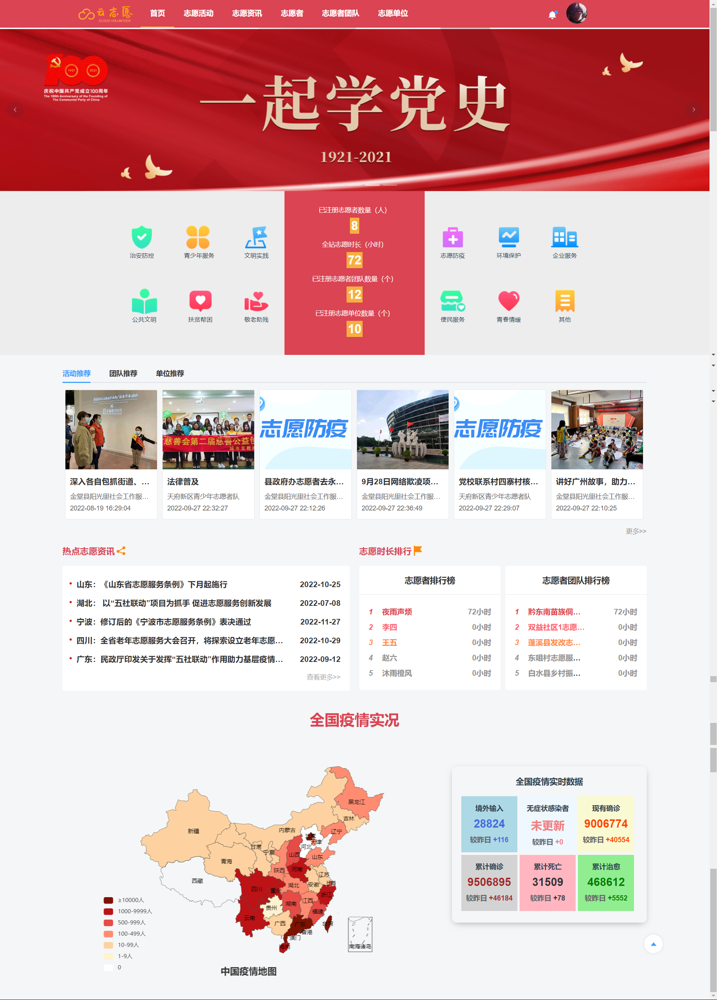

#### 2.1.2 志愿活动列表页

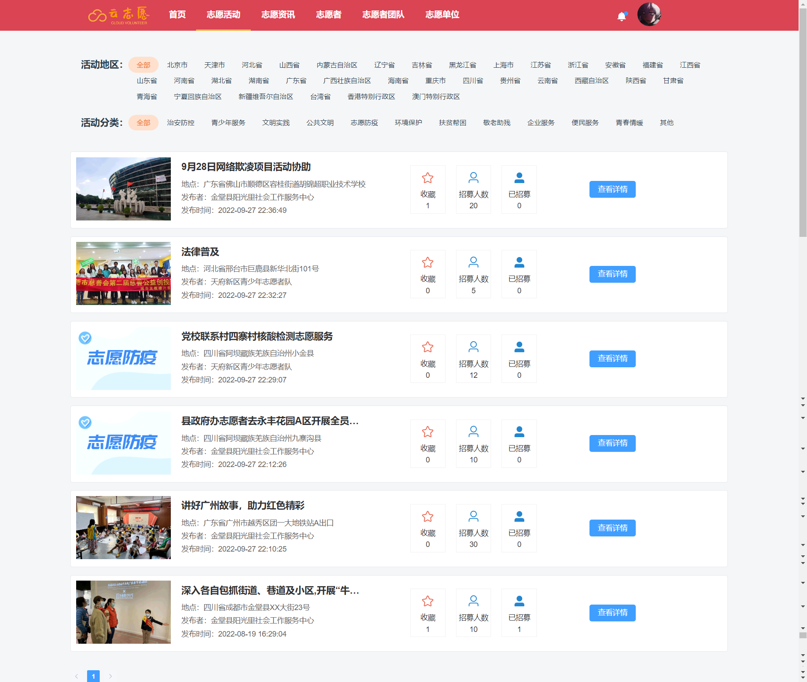

#### 2.1.3 志愿资讯列表页

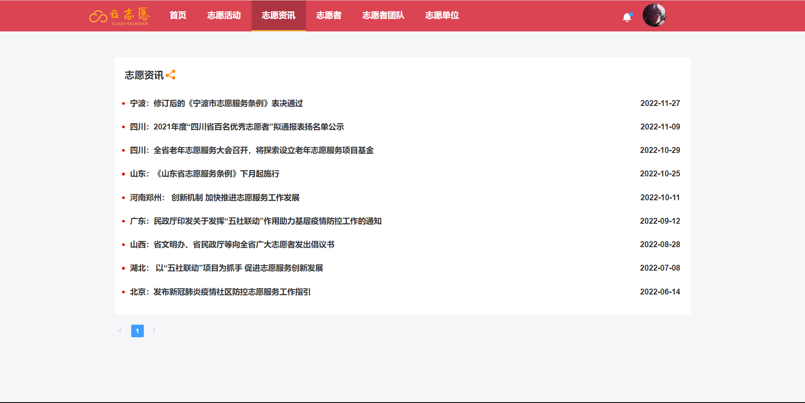

#### 2.1.4 志愿者用户列表页

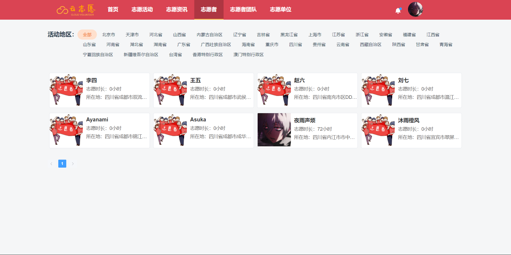

#### 2.1.5 用户信息详情页

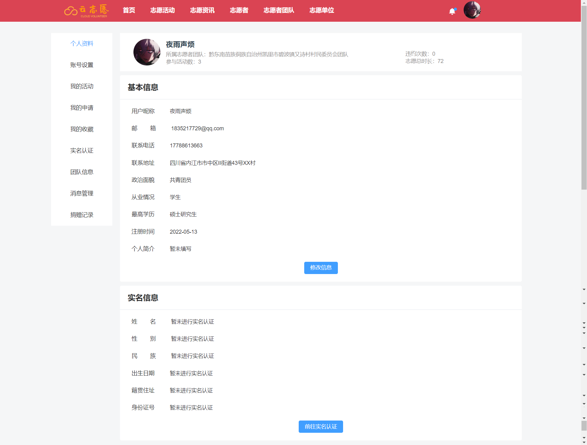

#### 2.1.6 志愿活动详情页

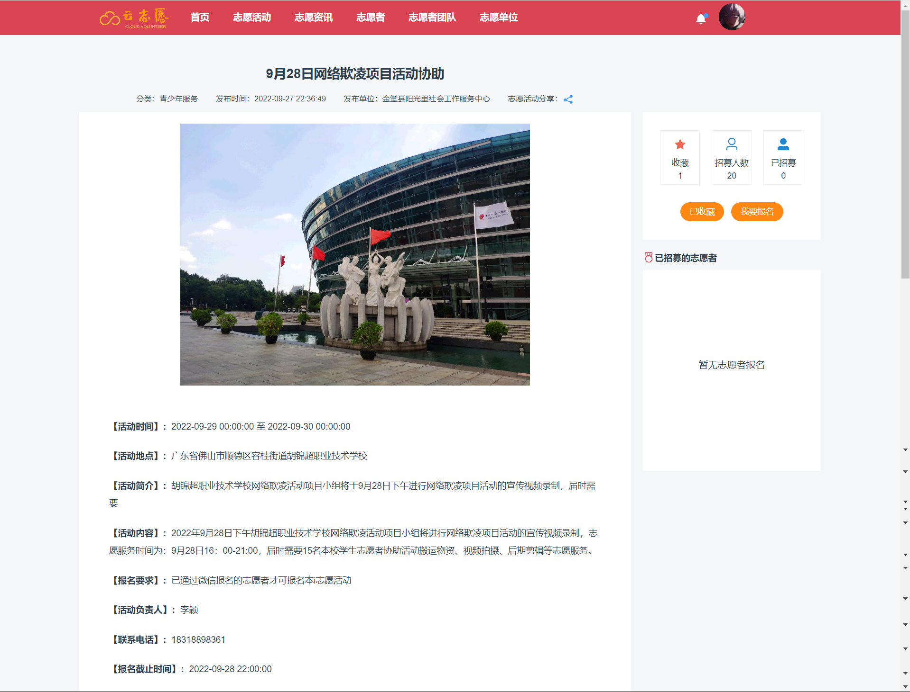

### 2.2 后台部分

#### 2.2.1 首页

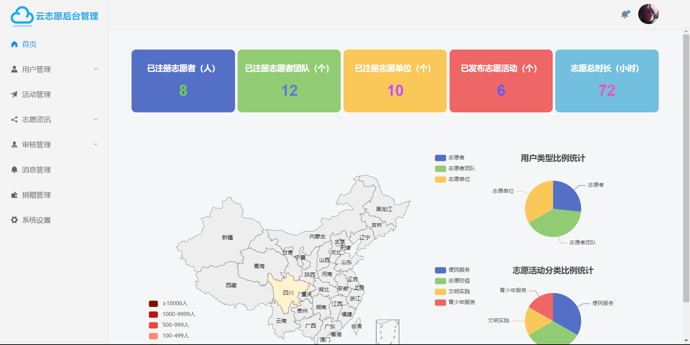

#### 2.2.2 用户管理

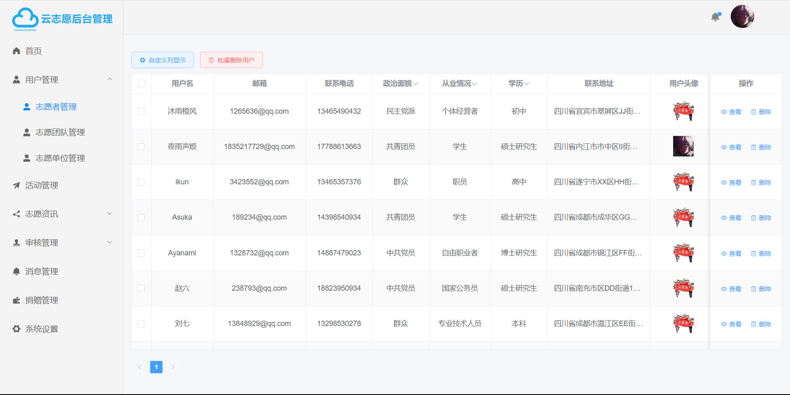

#### 2.2.3 活动管理

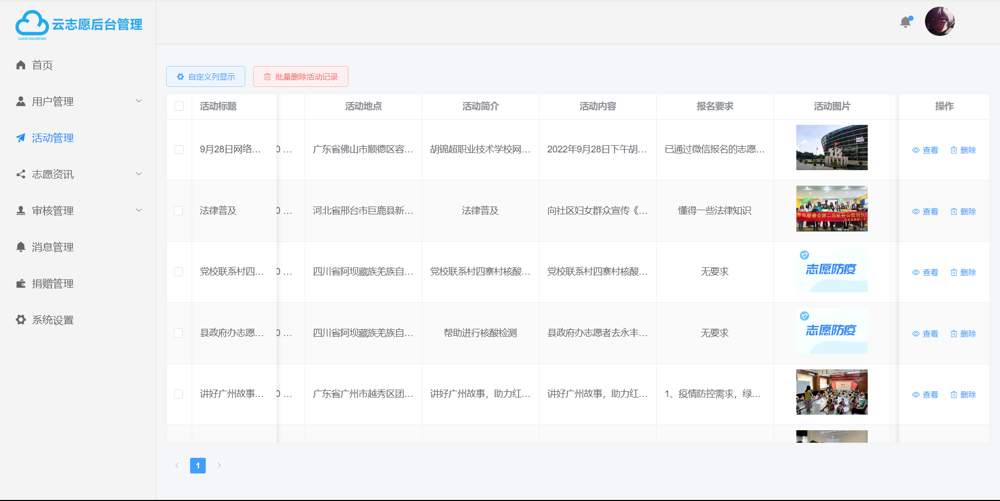

#### 2.2.4 资讯管理

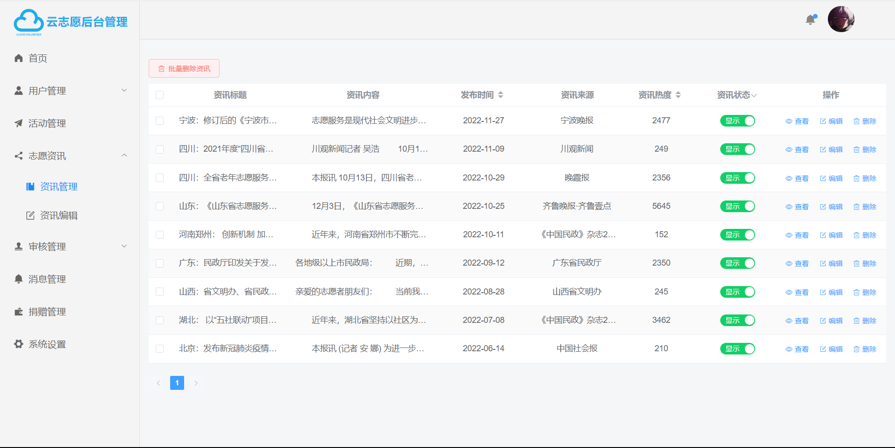

## 三、后端部署

### 3.1 基本配置

1、创建名为`volunteerdb`的数据库，导入sql文件并执行，将表结构和数据导入到数据库

2、修改`application.yaml`配置文件中数据库的`url`、`username`、`password`等配置与自己的数据库配置相同

3、在`pom.xml`文件下载依赖

4、其余配置可根据自己情况进行修改

### 3.2 特殊配置

#### 3.2.1 支付宝沙箱支付

整合支付宝沙箱支付环境具体可看[这篇教程](https://blog.csdn.net/weixin_51324855/article/details/124097792)和[这篇教程](https://www.wangt.cc/2022/01/%E6%B2%99%E7%AE%B1%E6%94%AF%E4%BB%98%E5%AE%9E%E7%8E%B0%E6%89%AB%E7%A0%81%E6%94%AF%E4%BB%98%E6%95%99%E7%A8%8B%EF%BC%88%E5%89%8D%E5%90%8E%E7%AB%AF%E5%88%86%E7%A6%BB%E7%89%88%EF%BC%89/)，这里只简单提一下

进入[支付宝开放平台](https://open.alipay.com)，登录后进入控制台，在底部开发工具推荐中找到`沙箱`，获取到自己的`APPID`

利用`支付宝开放平台开发助手`生成自己的公钥和私钥

在配置文件中对应部分进行修改

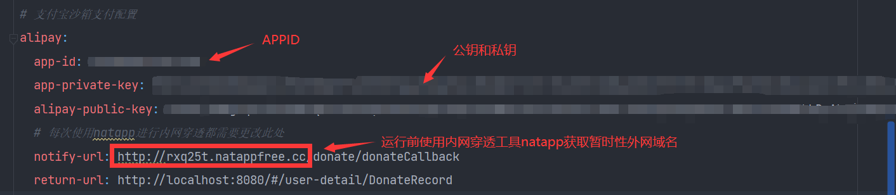

#### 3.2.2 容联云短信验证码

前往[容联云](https://www.yuntongxun.com/)进行注册，获取自己的相关信息，对下面进行修改

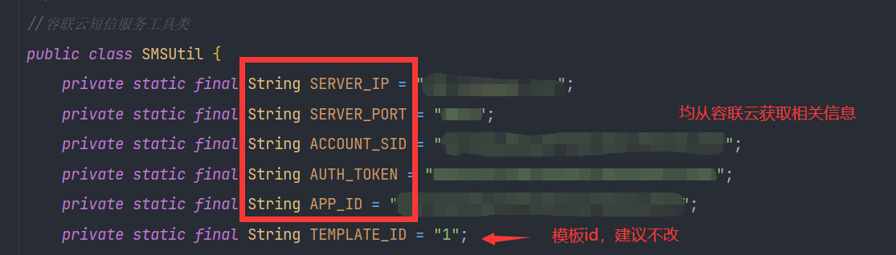

注：现在不知道什么原因手机接收到的短信都是00000，但是可以通过redis查看验证码具体内容

#### 3.2.3 实名认证

前往[翔云](http://www.netocr.com/)注册登录，购买`证件识别`服务，然后在个人中心的基础信息中获取自己的`key`和`secret`，修改对应部分内容

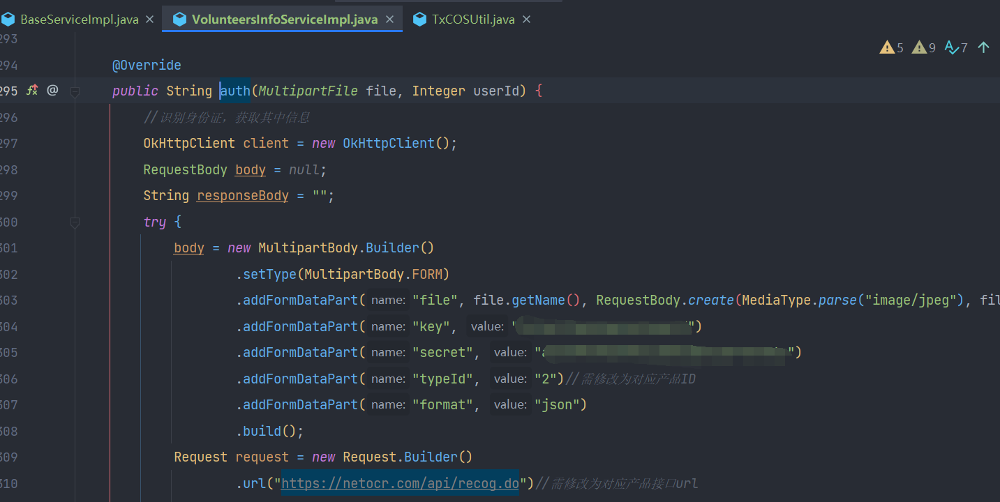

#### 3.2.4 对象存储COS

前提是要在对象存储中创建自己的存储桶，这个可以自己在腾讯云中看文档进行创建（对象存储[快速入门](https://cloud.tencent.com/document/product/436/38484)和[SDK快速入门](https://cloud.tencent.com/document/product/436/10199)）

前往[腾讯云控制台](https://console.cloud.tencent.com)登录后找到访问管理，然后在访问密匙中获取自己的腾讯云`SecretID`和`SecretKey`，然后填写到下方

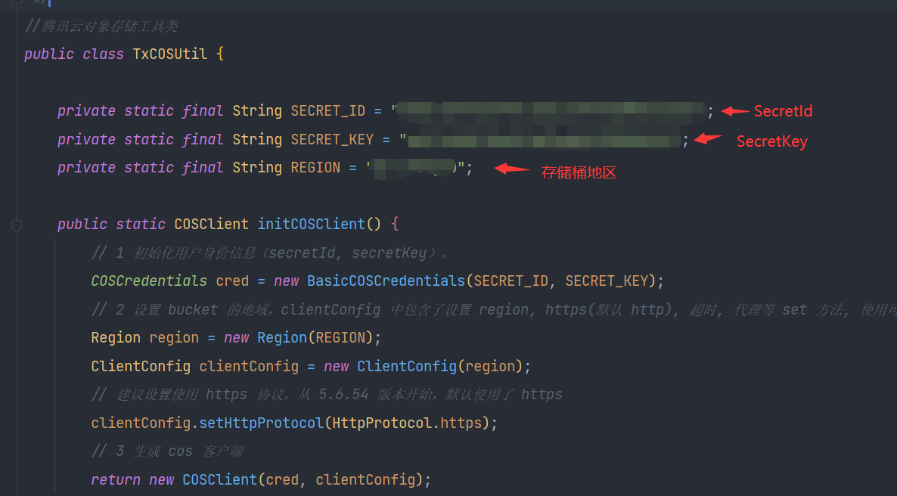

然后对使用到的地方进行修改（存储桶名字和存储桶全名都可在点击具体的存储桶后的概览中获取）

上传图片：

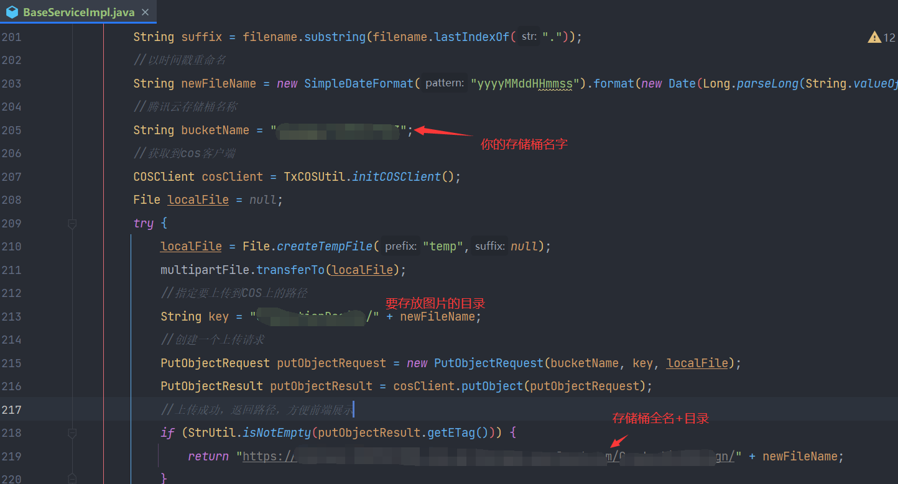

删除图片：

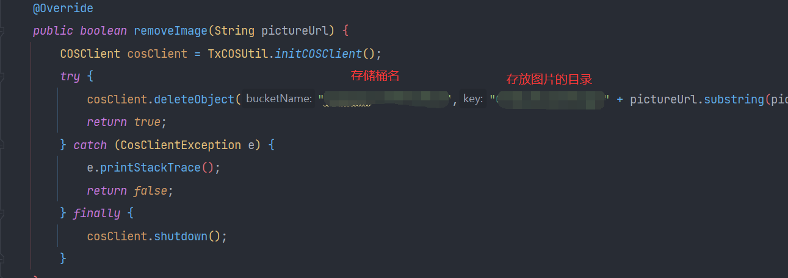

到此，后端的配置修改应该就结束了，这时后端就可以运行起来

## 四、前端部署

对于前端的部署就非常简单了，导入项目后只需在`Terminal`中输入`yarn`安装好相关依赖，然后输入`vite`命令即可运行项目

前台在浏览器地址栏直接输入`localhost:8080/#/`，后台则输入`localhost:8080/#/admin`